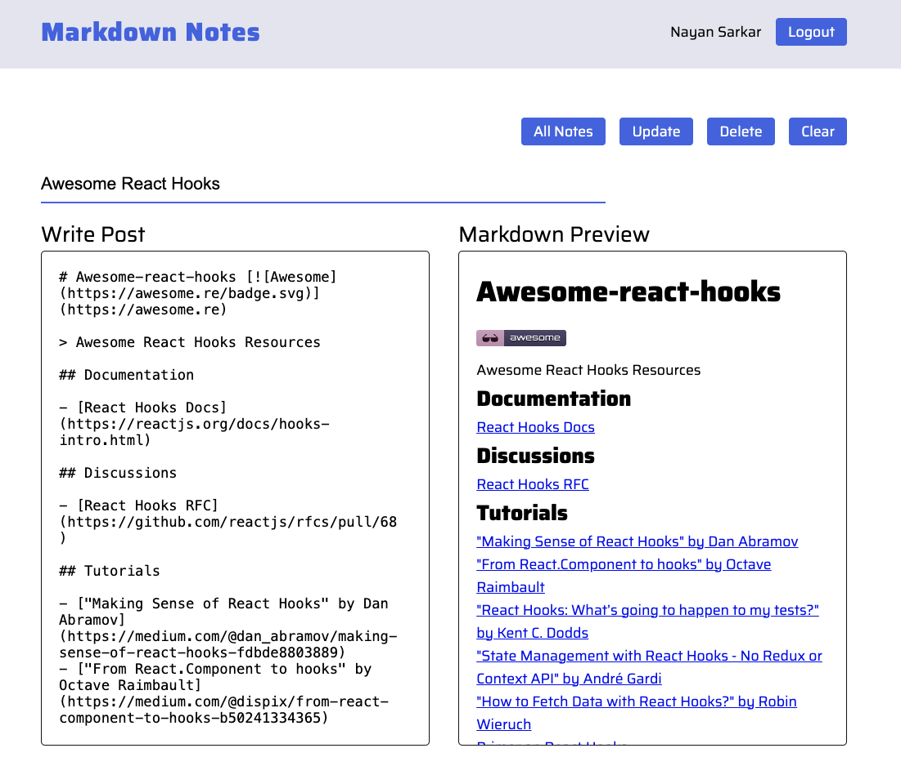
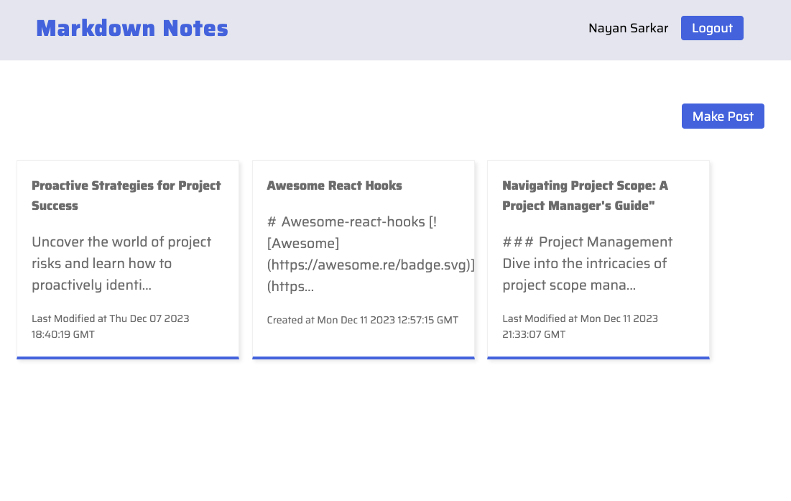
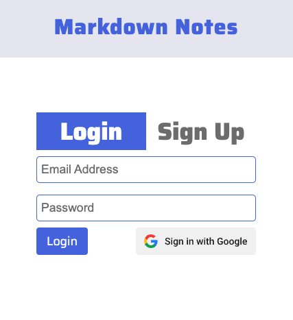

# Markdown Notes
A single page web app which allows users to create notes with markdown syntax

## Live Site
https://markdown-notes-2a9eb.web.app/

## Built With
   

## Features
- Built with React 18 using Functional Components on the Frontend and Firestore Realtime Database on the Backend
- Full Responsive, compatible with Mobile, Tablet and Desktop screen sizes
- Integrated with [React Markdown](https://github.com/remarkjs/react-markdown) to render markdown syntax
- Page Routing with Route Protection done with React Router 6
- Deployed on Google Cloud Platform with Firebase Authentication and Cloud Firestore Realtime NoSQL database
- State Management across the entire app done with Context API

## Images

